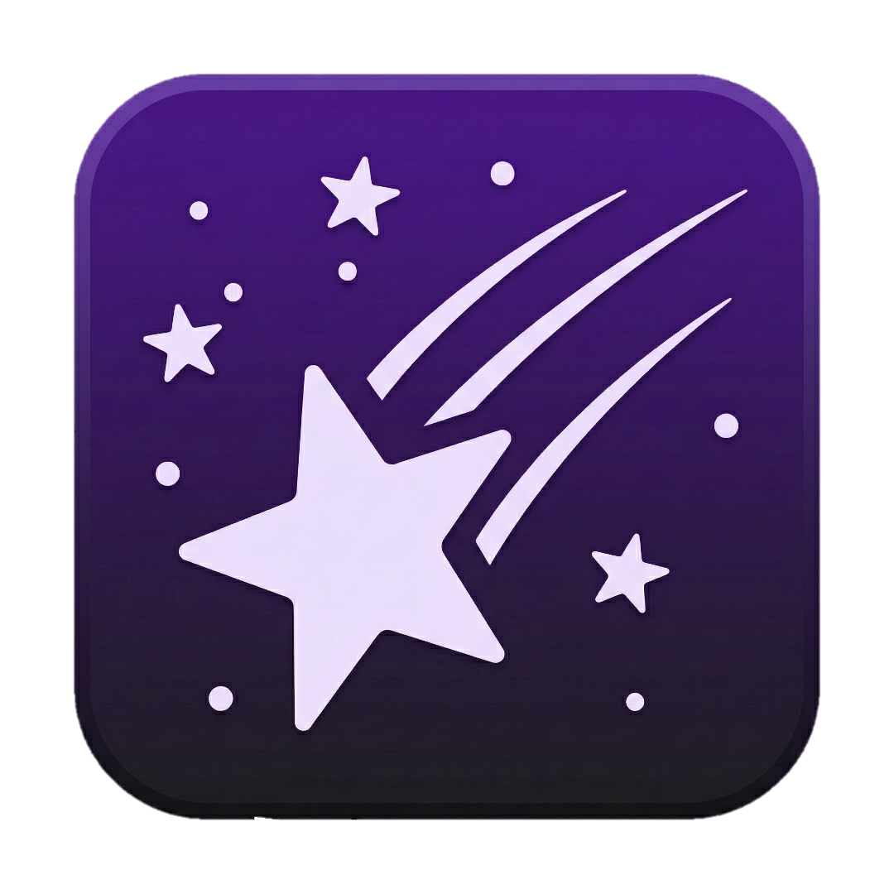
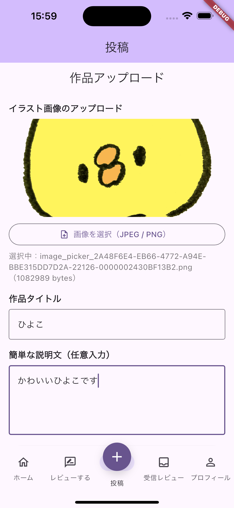
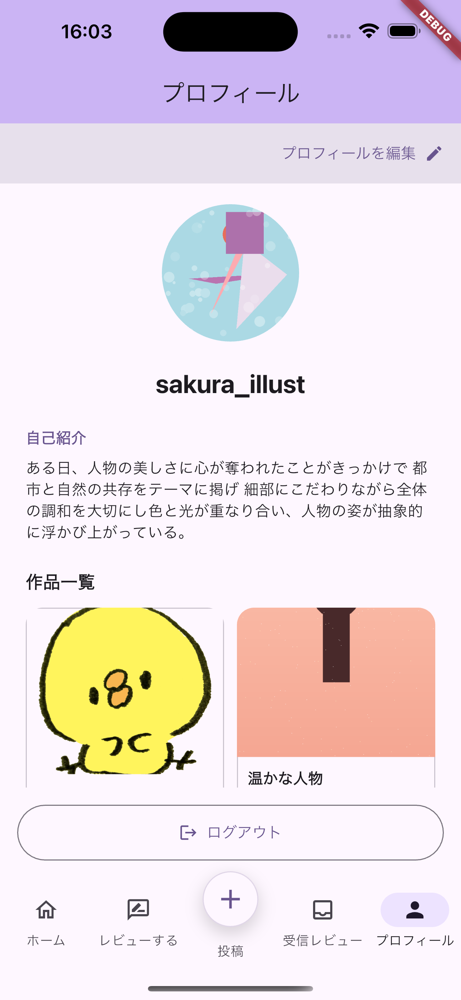

## プロダクト名

**Kiratto（キラット）**

---

## コンセプト

**作品ベースで出会い、言語化されたレビュー（キラット）を交換して、創作のフィードバックループを回す。**
SNS の一対多の拡散ではなく、「届くレビュー」を中心に設計する。

---

## 対象ユーザ

- **創作を続けている人**（イラスト、写真、デザイン等）で、作品に対する具体的なフィードバックがほしい人
- SNS で「いいね」は付くが、**言葉としての反応が得られにくい**／埋もれやすいと感じている人
- 「界隈」や過度な拡散よりも、**落ち着いた相互応援**（コミュニティ）を好む人

---

## 利用の流れ

1. **Signup / Login**
   アカウントを作成してログインします。

2. **Home（作品を見る）**
   作品カードを閲覧し、興味のある作品に反応（スワイプ/Like）します。
   ※ 人ではなく「作品」を起点に出会う設計です。

3. **マッチ成立（作品同士の相互 Like）**
   お互いの作品に対して Like が成立するとマッチが成立し、レビューの往復が始められます。

4. **レビュー投稿（キラットを届ける）**
   レビュー投稿画面には、初期印象・観察・解釈などの**ガイドライン（観点）**を表示し、
   「なんとなく好き」を避けて言語化しやすくします（観点はシステム側で提示）。

5. **Unlock（1 レビューで解除）→ 受信レビュー閲覧（キラットを受け取る）**
   受信レビュー閲覧など一部機能は初期状態でロックされており、**レビューを 1 件投稿すると解除**されます。
   「作品を投稿しただけではレビューが来ない」状態を意図的に作り、レビュー循環への参加を促します。

---

## 推しポイント

- **Give-to-Get（1 レビューで unlock）で“届く”を担保**
  受け身の投稿だけではなく、まずレビューを届けることで循環を開始させます。

- **レビューの質を上げる“観点提示”**
  初期印象・注目点・改善/伸びしろなど、レビューが制作の次アクションに繋がるよう誘導します。

- **SNS と異なる設計（埋もれにくい）**
  拡散・タイムラインではなく、マッチとレビューを軸にして、言葉が流れて消える体験を避けます。

- **実装面の裏付け（Backend）**
  スワイプは即保存・即レスポンス、マッチ判定は非同期処理で UX を止めない。
  マッチ生成は冪等でデータが壊れにくい。主要 API はテスト整備＋ CI で回し、デモ安定性を高めています。

---

- 既存 SNS では作品への感想が**タイムラインに埋もれやすい**
- 「なんとなく良い」を超えた**言語化されたフィードバック**が得にくい
- 人気が偏り、注目されにくい作品が**見られないまま流れてしまう**

### 提供する価値

- **Give-to-Get**: レビューを書くことで、自分の作品へのレビューが届く
- **言語化を支援**: 質問ガイドで「どこが良いか」を具体的に伝えられる
- **観る楽しさも広げる**: 観察 → 言語化を通じて、鑑賞体験そのものも豊かに

## 🎯 対象ユーザ

- 創作活動をしている方（イラスト、デザイン、写真など）
- 作品に対する**具体的なフィードバック**が欲しい方
- 他者の作品を見て**言葉にする体験**を楽しみたい方
- SNS の拡散ではなく**1 対 1 で届く応援**を求める方

## 🔄 利用の流れ

  <!-- 
  
  
   -->

1. **作品と出会う**
   - スワイプ形式で作品カードを閲覧
   - 気になった作品にレビューを書く
2. **レビューを書く**
   - 質問ガイドに沿って言語化をサポート
   - 「色/構図/質感」など観点を提示
3. **レビューが届く**
   - 自分の作品へのレビューを受け取る
   - マッチした相手とレビューを交換
4. **作品を投稿**
   - 自分の作品をアップロード
   - レビュー循環の輪に参加

## ✨ 推しポイント

### 🎨 体験設計

- **Give-to-Get の循環設計**
  - レビューを書くことで、自分へのレビューが届く仕組み
  - 創作者同士が応援し合い、次の制作につながる
- **言語化を支援する質問ガイド**

  - 「どの要素が効いているか」「どこで感情が動いたか」
  - システムが観点を提示し、フィードバックの質を向上
  - 書く楽しさと、観る楽しさの両方を大切に

- **作品起点のマッチング**
  - 人ではなく作品ベースで出会う
  - 拡散ではなく、1 対 1 で届くレビュー
  - 作品への敬意と、丁寧な鑑賞体験を重視

### 💡 差別化ポイント

- **レビューが埋もれない設計**
  - 作品単位でレビューが蓄積され、振り返り可能
  - 届いたフィードバックが次の創作に活きる
- **観る側の楽しさも創出**
  - 観察 → 言語化のプロセスそのものが新しい体験に
  - 作品を通じた、創作者と鑑賞者の対話

## 🖼️ スクリーンショット

<table>
  <tr>
    <td align="center">
      
       
      <b>ホーム画面</b>
    </td>
    <td align="center">
      
       
      <b>レビュー作成</b>
    </td>
    <td align="center">
      
       
      <b>投稿</b>
    </td>
    <td align="center">
      
       
      <b>受け取ったレビュー</b>
    </td>
    <td align="center">
      
       
      <b>マイページ</b>
    </td>
  </tr>
</table>

---

## 👥 開発体制

### 役割分担

| メンバー            | 役割                                                           |
| ------------------- | -------------------------------------------------------------- |
| **shunto-ishiguro** | バックエンドアーキテクト                                       |
| **ざっきーぽてと**  | フロントエンドエンジニア                                       |
| **xrm07**           | フロントエンドエンジニア / プロジェクトリーダー / 発表資料作成 |
| **KAZZ00777**       | フロントエンドエンジニア                                       |

### 開発における工夫した点

- **Give-to-Get の最小実装**として「1 レビューで unlock」を採用し、実装コストを抑えつつ循環を作る。
- **レビューの言語化支援**を UI 側で先に実装し、データモデルが拡張されても体験が崩れないようにする。
- **CI で build/vet/test を自動実行**し、短期開発でも壊れにくい基盤を確保する。
- **マッチ判定は非同期**にして、スワイプ体験が重くならないようにする。

---

#### 🤝 チームワーク面

- **進捗の見える化と称賛**
  - 誰かが進捗を出したらリアクションを返し、前向きな雰囲気を維持
- **心理的安全性の確保**
  - マイナス発言をしないルールで、提案しやすい空気をつくる
- **アイスブレイクの実施**
  - トランプやダイスで遊び、好きなお菓子を持ち寄って会話を促進

#### 📊 プロジェクトマネジメント面

- **柔軟で継続的なタスク管理**
  - GitHub Issues で細かくタスクを分割
  - Issue/PR テンプレートを整備し標準化
  - ラベル管理で進捗を可視化
  - 完璧を求めすぎず、改善を重ねる文化
- **稼働の見える化**
  - 調整さんを作成し、各自の作業可能時間を共有
- **GitHub Projects による一元管理**
  - <a href= "https://github.com/orgs/p2hacks2025/projects/33"> バックログ</a>に全タスクを集約し、進捗・担当・目標を即確認可能に
- **レビュー負荷の軽減**
  - Issue/PR テンプレートで状況共有を標準化
  - GitHub Copilot のレビューフォーマットも整備し修正サイクルを短縮
- **小さく早い開発サイクル**
  - PR で素早くフィードバック
  - レビュー文化で品質を担保
  - 失敗を恐れず、学びに変える姿勢
- **品質保証**
  - 全 API エンドポイントにテストコードを実装

#### 💻 技術面

- **開発環境の統一**
  - Issue/PR テンプレートを設定し、担当者が状況をわかりやすいように
- **ユーザー体験を第一に**

  - UI/UX の継続的な改善
  - 直感的な画面遷移設計
  - 創作者が迷わず使えることを重視

- **ドキュメント整備**
  - API 設計書の作成
  - データベース設計の明確化

---

## 🛠️ 開発技術

<!-- 詳細なシステム構成図を配置することを推奨 -->

### 利用したプログラミング言語

- Go（Backend）
- Dart（Frontend）

### 利用したフレームワーク・ライブラリ

- Flutter（フロントエンド）
- Gin（Go の Web フレームワーク）
- Supabase（PostgreSQL / Auth / Storage）

### その他開発に使用したツール・サービス

- GitHub（リポジトリ管理、Issues/Projects、Actions による CI）
- Supabase Dashboard（DB/Storage 管理）
- Gemini (UI の調整．手元でビルドができない際に，画像生成で UI の状態を確認する)
- NotebookLM (仮スライド作成)
- ChatGPT（プレゼン，ユーザーストーリーの作成のため，壁打ちに利用）
